# Avito Text Bot
## About Project
Бот генерирует продающие текста для объявлений Avito. Пользователь вводит данные о товаре и ИИ используя заготовленный промт генерирует текст для продажи.  
Проект состоит из:
+ Telegram bot (aiogram)
+ Web admin panel (FastAPI + Jinja2)
+ OpenRouter
+ SQLite database

## Tech Stack
+ Python 3.9+
+ FastAPI
+ Jinja2
+ Uvicorn
+ Aiogram
+ SQLAlchemy
+ APScheduler
+ OpenRouter API

## Installation
Клонируйте репозиторий себе на устройство
```commandline
git clone https://github.com/Qetzal-22/AvitoTextBot
cd AvitoTextBot
```
Установка зависимостей
```commandline
pip install -r requirements.txt
```
Создание .env
```
TOKEN_BOT_API = "YOUR BOT TOKEN"
TOKEN_OR_API = "YOUR OPEN ROUTER TOKEN"
PASSWORD_API = "PASSWORD FOR ENTER ADMIN PANEL"
SESSION_SECRET_KEY = "GENERATE BIG RANDOM NUMBER"
```
Запуск
```commandline
python main.py
```

## Run with Docker
### Build image

`docker build -t avito_text_bot .`

### Run container

`docker run -d --name avito_text_bot avito_text_bot`

## Project Structure
```md
├───app
│   ├───ai           #AI request logic
│   ├───api          #FastAPI admin panel
│   ├───bot          #Telegram bot
│   ├───config       #Config
│   ├───db           #DataBase model and crud
│   ├───scheduler    #Background jobs
│   ├───services     #Business logic
│   ├───utils        #Helper functions
└───data             #DB and .log 
```

## Features
+ Telegram bot interface
+ AI generation text
+ Web admin panel
+ Subscription system

## Admin Panel
Admin panel allows:
+ manage users
+ manage payments
+ view analytics
+ monitor requests

URL:
> http://localhost:8000/login

## Screenshots
### Telegram bot
Start and register

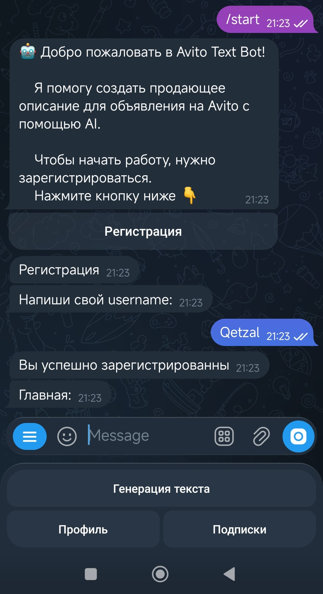

Profile

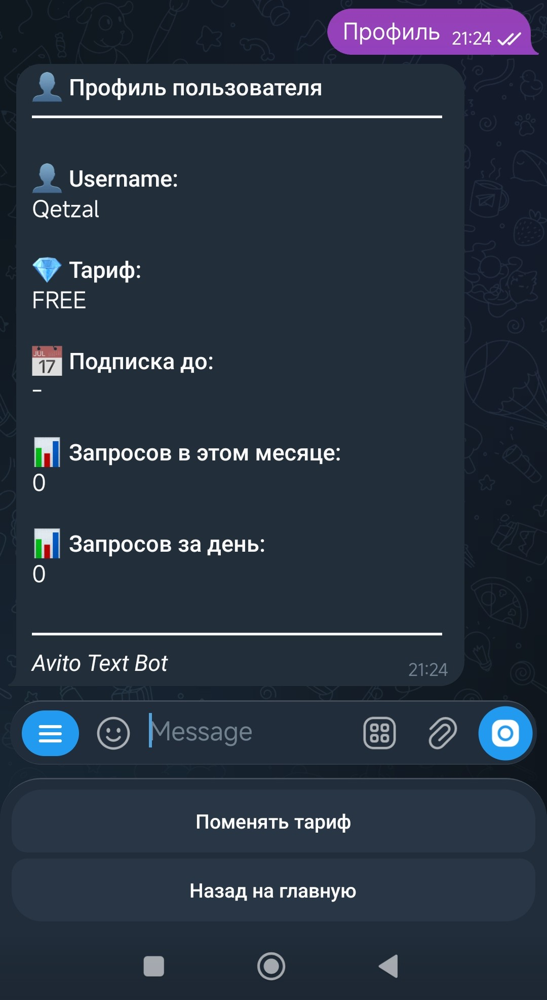

View data plan

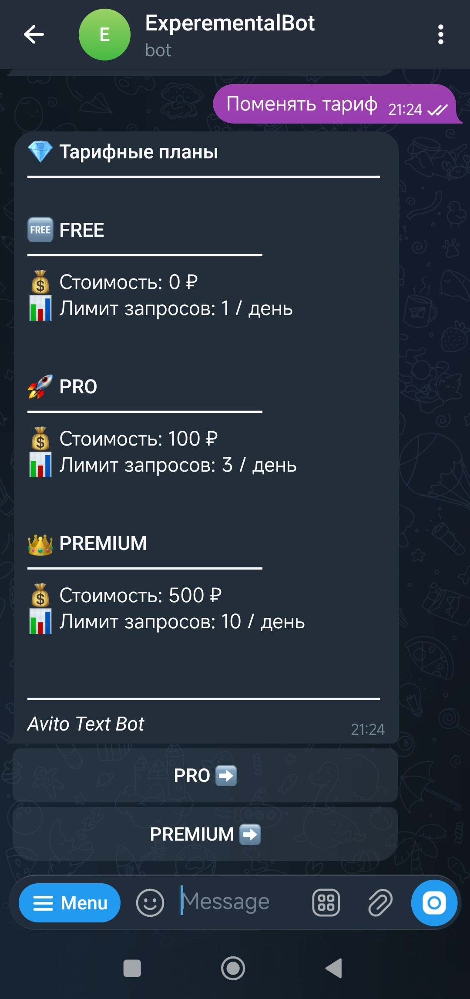

Pay plan

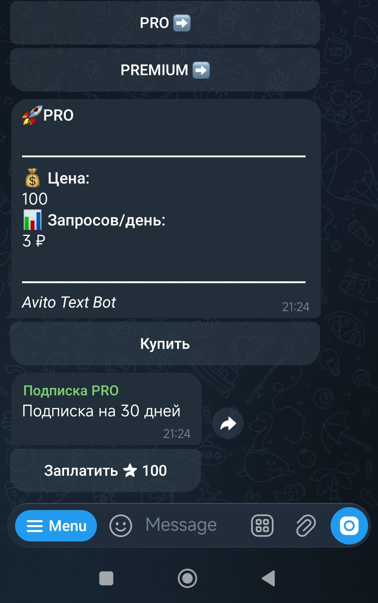

Generate text

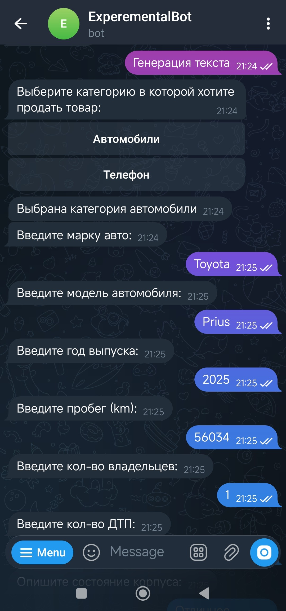
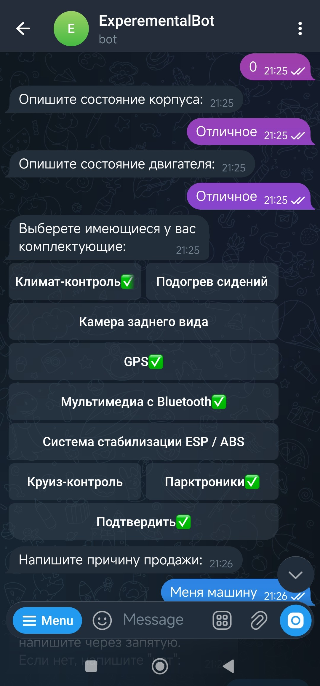
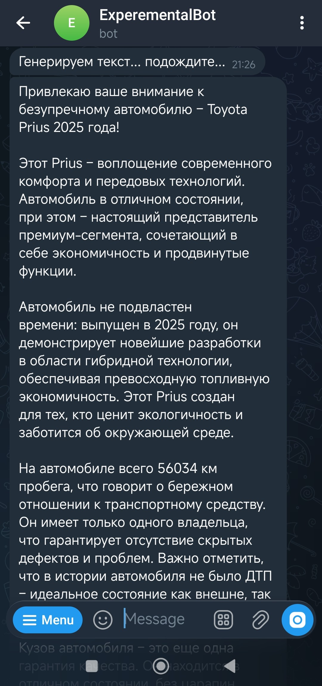


### Admin Panel
Login
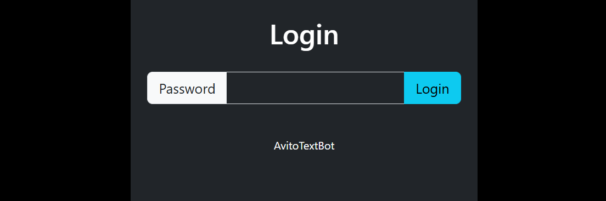

Dashboard
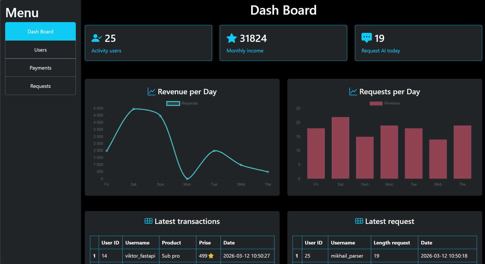
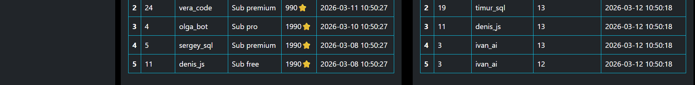

Users
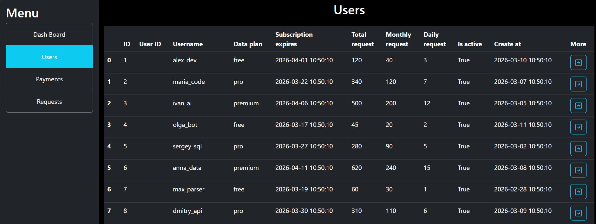

User
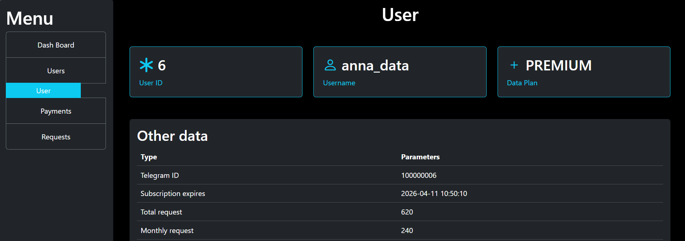
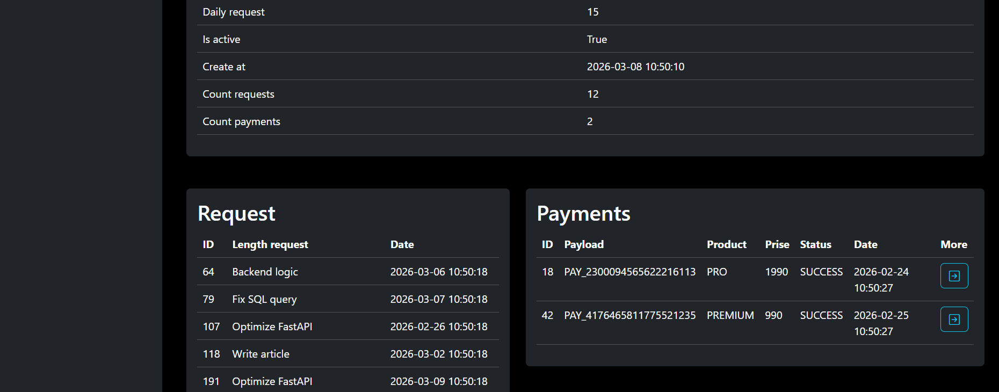

Payments
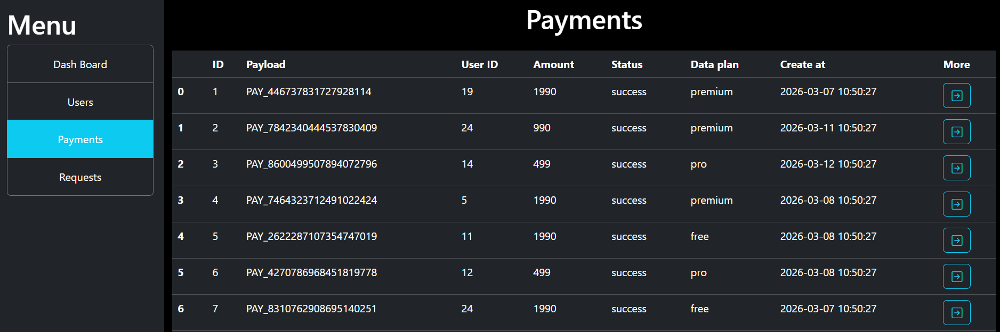

Payment
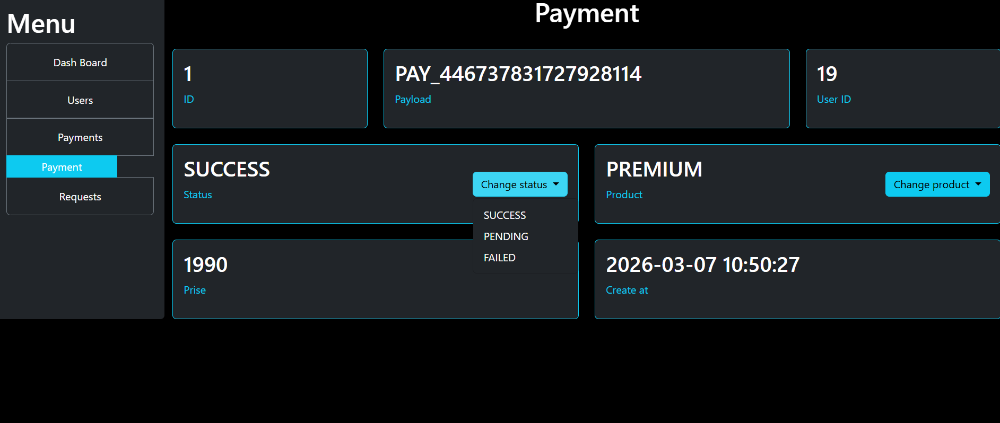

Requests
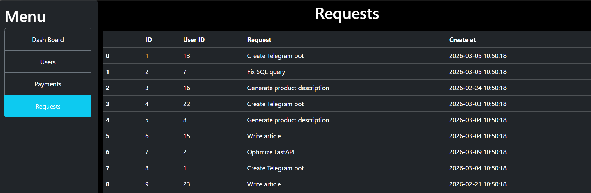


## Configuration
| Variable | Description |
|--------|--------|
TOKEN_BOT_API | Telegram bot token |
TOKEN_OR_API | OpenRouter API token |
PASSWORD_API | Password for admin panel |
SESSION_SECRET_KEY | Secret key for sessions |


## Bot Commands
+ `/start` - Запуск бота, вывод приведственного сообщения
+ `/register` - Регистрация пользователя для доступа к функционалу
+ `/main` - Переход к главному меню
+ `/help` - Помощь, кратное описание команд и возможностей бота

## Admin API endpoints
+ /dashboard
+ /users
+ /requests
+ /payments
+ /login